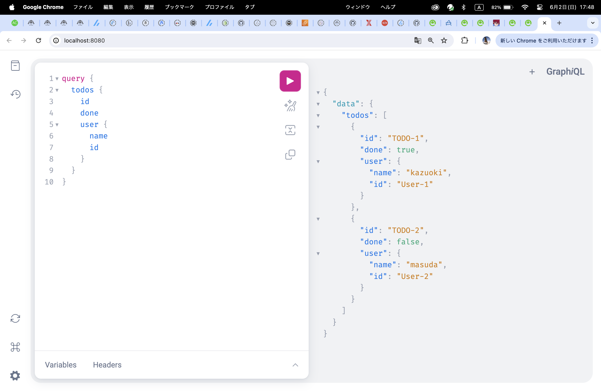
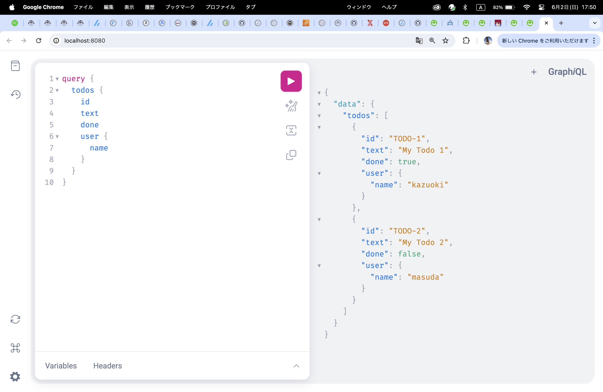
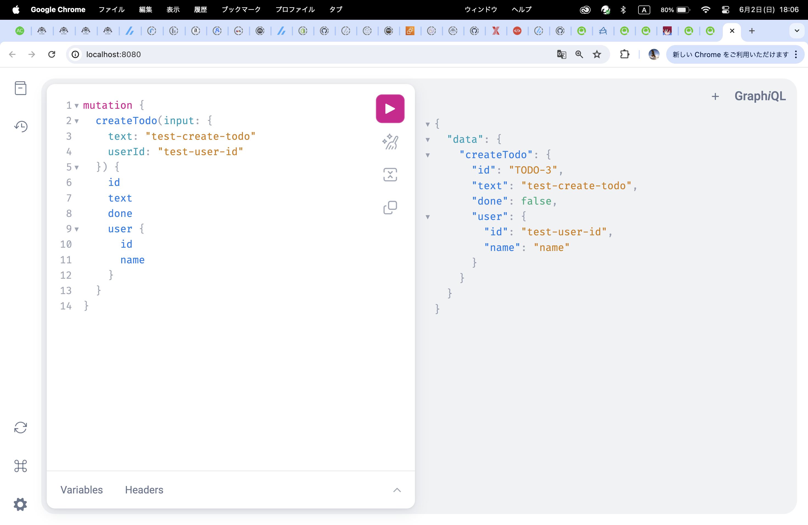

# 02 GraphQLサーバーを動かしてみる

## 環境構築
[この記事](https://www.asobou.co.jp/blog/web/gqlgen)を参考にgoでgraphqlを使う環境を構築．
書籍の第二章の説明のままコマンドを打ってもうまくいかなかった．

```
% go mod init github.com/2nagatomo2/graphql_go/02
go: creating new go.mod: module github.com/2nagatomo2/graphql_go/02
% go get -u github.com/99designs/gqlgen
% go run github.com/99designs/gqlgen init
% go mod tidy 
```

## サンプルコードの生成
 以下のようなTODO管理APIのコードが，サンプルで生成される．
 ```
.
├── README.md
├── go.mod
├── go.sum
├── gqlgen.yml
├── graph
│   ├── generated.go
│   ├── model
│   │   └── models_gen.go
│   ├── resolver.go
│   ├── schema.graphqls
│   └── schema.resolvers.go
└── server.go

3 directories, 11 files
```

### graph/schema.graphqls - GraphQLスキーマ定義
#### スキーマとは
- データの形状を定義する設計図として機能する
- データの取得方法や変更方法を定義する、クライアントとサーバー間の契約でもある
つまりスキーマ定義言語(SDL)で書かれたAPI仕様書のようなもの．
`.graphqls` という拡張子をつける．
スキーマで定義されたものの実体をオブジェクトと呼ぶ．

- どのようなオブジェクト型が用意されているか
- どのようなクエリ（select）・ミューテーション(insert, update, delete)があるのか
という情報を記述する．


**query, mutation**
対応関係は以下のようになっている．DBに変更を加えないのがquery，何かしらの変更を加えるのがmutation
|　　　| REST/SQL | GraphQL |
|-|-|-|
| 取得 | SELECT | Query |
| 登録 | INSERT | Mutation |
| 更新 | UPDATE | Mutation |
| 削除 | DELETE | Mutation |
| 検知 | なし | Subscribe |

```graphql
# GraphQL schema example
#
# https://gqlgen.com/getting-started/

type Todo {
  id: ID!
  text: String!
  done: Boolean!
  user: User!
}

type User {
  id: ID!
  name: String!
}

type Query {
  todos: [Todo!]!
}

input NewTodo {
  text: String!
  userId: String!
}

type Mutation {
  createTodo(input: NewTodo!): Todo!
}
```

これは，`Todo`, `User`などのスキーマを定義している，ということ．スキーマの構成要素をフィールドという．

- typeキーワードで始まるものはフィールド自体を表す型の定義（出力型のスキーマとも呼ばれる）
- inputキーワードで始まるものは入力型のスキーマ定義（型定義の引数に使われるものということ）

**エクスクラメーションマーク（!マーク）の意味**

上記スキーマ定義のidの型定義に「ID!」のように、エクスクラメーションマーク（!、ビックリマーク）がついています。エクスクラメーションマークがついているフィールドは、そのフィールドがnullになることがないことを意味します。つまり、上記例だと、idフィールはnullになることがなく、それ以外のフィールドはnullの可能性があるということを意味します。（記事から引用）

#### GraphQL のスキーマと型定義
[参考サイト](https://qiita.com/NagaokaKenichi/items/d341dc092012e05d6606)

##### GraphQLの型とは
GraphQLには大きく分けるとスカラー型とオブジェクト型がある．（enum型，union型，ルート型もある）

**スカラー型**
- String（文字列型）
- Int（整数型）
- Float（浮動小数点型）
- Boolean（論理型）
- ID（ID型）

以上の5つの型が存在する

**オブジェクト型**

1つ以上のスキーマで定義されているフィールドの集合をオブジェクト型という．JSONのように入れ子にすることが可能．


まとめるとこういうこと
```graphql
# GraphQL schema example
#
# https://gqlgen.com/getting-started/

# Todoという名前の出力型のスキーマ定義
type Todo {
  id: ID! # スカラー型（ID）
  text: String! # スカラー型（String）
  done: Boolean! # スカラー型（Boolean）
  user: User! # オブジェクト型（Userスキーマで定義されたフィールドの集合）
}

# Userという名前の出力型のスキーマ定義
type User {
  id: ID! # スカラー型（ID）
  name: String! # スカラー型（String）
}

# Queryという名前の出力型のスキーマ定義
type Query {
  todos: [Todo!]! # オブジェクト型（Todoスキーマで定義されたフィールドの集合のリスト）
}

# NewTodoという名前の入力型のスキーマ定義
input NewTodo {
  text: String! # スカラー型（String）
  userId: String! # スカラー型（String）
}

# Mutationという名前の出力型のスキーマ定義
type Mutation {
  createTodo(input: NewTodo!): Todo! # オブジェクト型（Todoスキーマで定義されたフィールドの集合）createTodoフィールドはNewTodo型のinputという名前の入力を引数として受け取る．
}
```

### grapg/model/models_gen.go - オブジェクト構造体の定義
`models_gen.go`は`schema.graphqls`で定義されたオブジェクトに対応するGoの構造体型を定義するファイル．
先頭に
```go
// Code generated by github.com/99designs/gqlgen, DO NOT EDIT.
```
とあるように，自動で生成され，編集はしてはいけない．

### graph/generated.go - リゾルバをサーバーで稼働させるためのコアロジック部分
書籍では後に紹介されているが，スキーマとリゾルバメソッドの繋がりを理解するために先に見ておいた方が良いと思う．
`generated.go`は3845行あるが，その中に，
```go
type MutationResolver interface {
	CreateTodo(ctx context.Context, input model.NewTodo) (*model.Todo, error)
}
type QueryResolver interface {
	Todos(ctx context.Context) ([]*model.Todo, error)
}
```
という部分がある．ここで，インターフェースを定義し，それぞれのインターフェースを継承する構造体がインターフェース内のメソッドを実装することを強制する．
```go
func (e *executableSchema) Complexity(typeName, field string, childComplexity int, rawArgs map[string]interface{}) (int, bool) {
	ec := executionContext{nil, e, 0, 0, nil}
	_ = ec
	switch typeName + "." + field {

	case "Mutation.createTodo":
		if e.complexity.Mutation.CreateTodo == nil {
			break
		}

		args, err := ec.field_Mutation_createTodo_args(context.TODO(), rawArgs)
		if err != nil {
			return 0, false
		}

		return e.complexity.Mutation.CreateTodo(childComplexity, args["input"].(model.NewTodo)), true
    
    // おそらくこの部分でQueryスキーマのtodosフィールドとリゾルバ構造体のTodosメソッドを繋いでいる．
	case "Query.todos":
		if e.complexity.Query.Todos == nil {
			break
		}

		return e.complexity.Query.Todos(childComplexity), true

	case "Todo.done":
		if e.complexity.Todo.Done == nil {
			break
		}

		return e.complexity.Todo.Done(childComplexity), true

	case "Todo.id":
		if e.complexity.Todo.ID == nil {
			break
		}

		return e.complexity.Todo.ID(childComplexity), true

	case "Todo.text":
		if e.complexity.Todo.Text == nil {
			break
		}

		return e.complexity.Todo.Text(childComplexity), true

	case "Todo.user":
		if e.complexity.Todo.User == nil {
			break
		}

		return e.complexity.Todo.User(childComplexity), true

	case "User.id":
		if e.complexity.User.ID == nil {
			break
		}

		return e.complexity.User.ID(childComplexity), true

	case "User.name":
		if e.complexity.User.Name == nil {
			break
		}

		return e.complexity.User.Name(childComplexity), true

	}
	return 0, false
}
```

このコードは自動生成される．編集はできない．

### graph/resolver.go ・ graph/schema.resolvers.go - リゾルバコード
#### リゾルバとは
[参考サイト](https://qiita.com/NagaokaKenichi/items/86272f2f654070b06488)
スキーマ定義にてクライアントが操作できるクエリや様々な型を定義しています。ただし、スキーマはあくまで定義のみで実際のデータ操作は行いません。実際のデータ操作を行うのがリゾルバというものになります。リゾルバの実態は特定のフィールドのデータを返す関数（メソッド）です。リゾルバはGraphQLサーバー開発者が提供する必要があります。

リゾルバファイルは，スキーマ定義されたフィールドたちの処理をする関数をまとめたファイル

#### graph/resolver.go
リゾルバ構造体`Resolver`型が定義されている．

#### graph/schema.resolvers.go
メソッドが定義されている．

スキーマ内で定義されたクエリ，ミューテーションと，生成されたリゾルバメソッドの対応関係は以下の通り．
- ミューテーション`createTodo(input: NewTodo!): Todo!`が呼ばれた時に`CreateTodo`メソッドが呼ばれる．
- クエリ`todos: [Todo!]!`が呼ばれた時，Todosメソッドが呼ばれる．

**生成時には`panic` が入っているが，ここを書き換えるのがサーバーサイドGraphQLの実装作業．**

**cf panic とは**
`panic` はGo言語におけるランタイムエラーのこと．
panicとはプログラムの継続的な実行が難しく、どうしよもなくなった時にプログラムを強制的に終了させるために発生するエラーです。
（[このサイトから引用](https://qiita.com/nayuneko/items/9534858156dfd50b43fb)）

### server.go - サーバーエントリーポイント
- デフォルトでは8080番ポートで稼働
- `/query` にGraphQLリクエストを送ると結果が返ってくる．
- `/` をブラウザで開くとクエリを実行するためのPlayGroundが使える．

### gqlgen.yml
コード生成の設定を記述するyamlファイル．見ればなんとなくわかる．

## 生成されたサンプルコードを動かす

### リゾルバメソッドの記述
実際はデータベースと接続して，データのinsertやselectをするが，今回は動作確認のため簡略化．
```go
// CreateTodo is the resolver for the createTodo field.
func (r *mutationResolver) CreateTodo(ctx context.Context, input model.NewTodo) (*model.Todo, error) {
	return &model.Todo{
		ID:   "TODO-3",
		Text: input.Text,
		User: &model.User{
			ID:   input.UserID,
			Name: "name",
		},
	}, nil
}

// Todos is the resolver for the todos field.
func (r *queryResolver) Todos(ctx context.Context) ([]*model.Todo, error) {
	return []*model.Todo{
		{
			ID:   "TODO-1",
			Text: "My Todo 1",
			User: &model.User{
				ID:   "User-1",
				Name: "kazuoki",
			},
			Done: true,
		},
		{
			ID:   "TODO-2",
			Text: "My Todo 2",
			User: &model.User{
				ID:   "User-2",
				Name: "masuda",
			},
			Done: false,
		},
	}, nil
}
```

こんな感じにした．

### サーバーの起動
エントリポイントである，`server.go`を実行．
```
kazuokinagatomo@kazuoki graphql_go % go run server.go
2024/06/02 17:39:25 connect to http://localhost:8080/ for GraphQL playground
```

### Playgroundからクエリを実行
`http://localhost:8080/`をブラウザで開くとPlaygroundにアクセスできる．
`todos`クエリ，`createTodo`ミューテーションの実行結果は以下

- todos1


- todos2

欲しい結果を変えても，過不足なく返ってくる．

- createTodo

出力型で定義しているので，何か出力が必要
`done` はデフォルトで`false`になるように`generated.go`が設定してくれている．